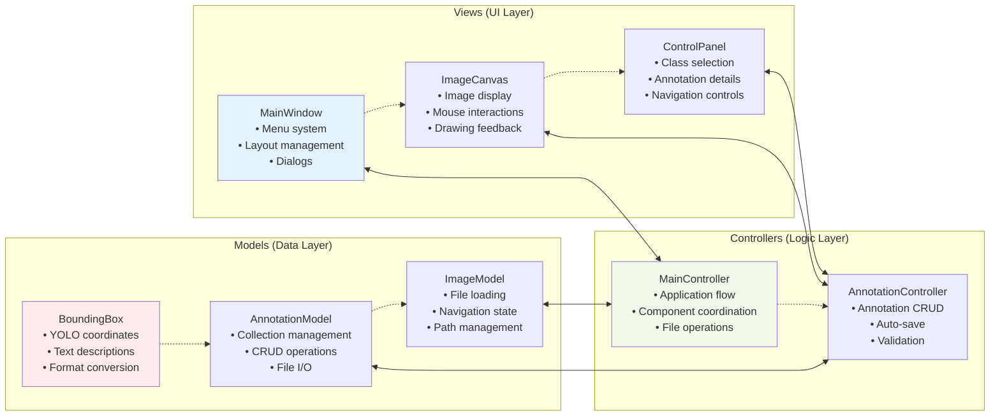
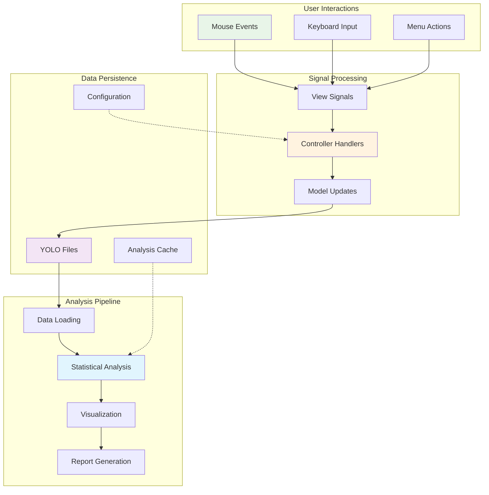
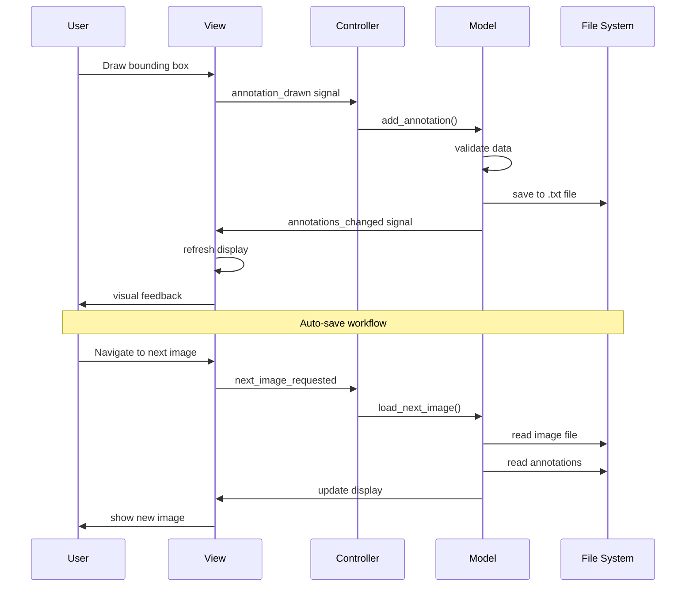
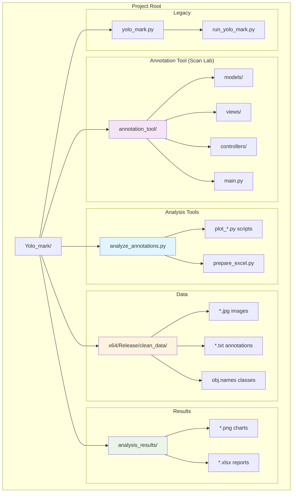
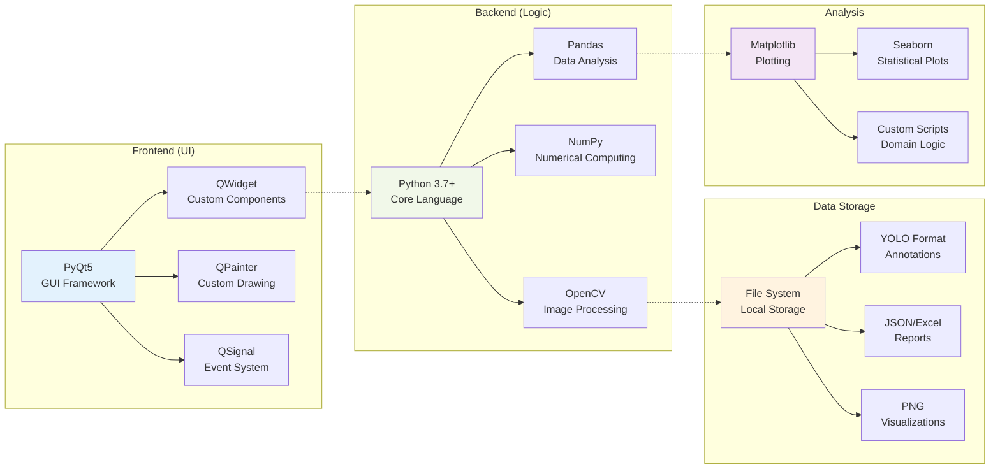

# Project Architecture Diagrams

## System Overview

```mermaid
graph TB
    subgraph "YOLO ANNOTATION ECOSYSTEM"
        subgraph "Input Layer"
            A[Raw Images]
            B[Existing Annotations]
            C[Class Definitions]
        end

        subgraph "Processing Layer"
            D[Annotation Tool (Scan Lab)<br/>MVC Architecture]
            E[Analysis Scripts<br/>Python Tools]
        end

        subgraph "Output Layer"
            F[New Annotations<br/>YOLO Format]
            G[Visualizations<br/>PNG Charts]
            H[Reports<br/>Excel Files]
        end

        subgraph "Storage Layer"
            I[File System<br/>Images + Annotations]
            J[Analysis Results<br/>Charts + Reports]
        end
    end

    A --> D
    B --> E
    C --> D
    C --> E

    D --> F
    E --> G
    E --> H

    F --> I
    G --> J
    H --> J

    style D fill:#f3e5f5
    style E fill:#e1f5fe
    style I fill:#fff3e0
```

## Annotation Tool (Scan Lab) MVC Architecture



## Data Flow Architecture



## Component Interaction Diagram



## File System Organization



## Technology Stack



## Deployment Architecture

```mermaid
graph TB
    subgraph "Development Environment"
        DE1[Source Code<br/>Git Repository]
        DE2[Python Interpreter<br/>3.7+]
        DE3[Dependencies<br/>requirements.txt]
    end

    subgraph "Runtime Environment"
        RE1[Annotation Tool (Scan Lab)<br/>Main Process]
        RE2[File System<br/>Data Storage]
        RE3[OS Integration<br/>File Dialogs]
    end

    subgraph "User Environment"
        UE1[Windows/Linux/Mac<br/>Cross-platform]
        UE2[Mouse + Keyboard<br/>Input Devices]
        UE3[Display<br/>1280x720+ recommended]
    end

    DE1 --> RE1
    DE2 --> RE1
    DE3 --> RE1

    RE1 --> UE1
    RE2 --> UE1
    RE3 --> UE1

    UE2 --> RE1
    UE3 --> RE1

    style DE1 fill:#e1f5fe
    style RE1 fill:#f3e5f5
    style UE1 fill:#e8f5e8
```
